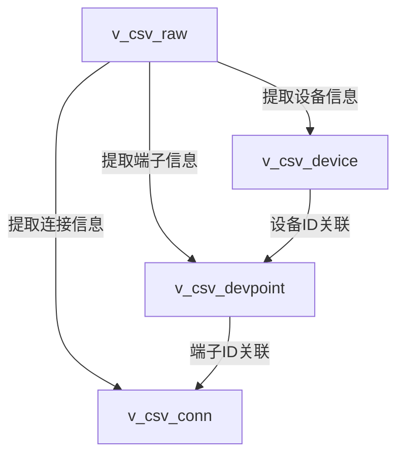
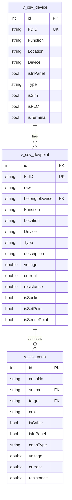

# c0b_createdb.py 实现计划

## 概述
创建三个新的数据库表（v_csv_device、v_csv_devpoint、v_csv_conn），用于存储设备、端子和连接信息。所有数据将从现有的v_csv_raw表中提取，且保持原始表不变。

## 数据流程

## 表结构关系

## 实现步骤

### 1. 数据库连接和初始化
- 从config.json读取MySQL配置
- 建立数据库连接
- 创建所需的三个表（使用提供的表结构）

### 2. 数据处理流程

#### a) 创建设备表(v_csv_device)
- 从v_csv_raw表中提取unique的设备信息
- 处理设备类型判断(isPLC, isSim等)
- 插入v_csv_device表

#### b) 创建端子表(v_csv_devpoint)
- 从v_csv_raw表中提取所有端子信息
- 关联对应的设备ID
- 处理端子类型和属性
- 插入v_csv_devpoint表

#### c) 创建连接表(v_csv_conn)
- 从v_csv_raw表中提取连接信息
- 关联源端子和目标端子
- 设置连接属性
- 插入v_csv_conn表

### 3. 数据验证
- 检查数据完整性
- 验证关联关系
- 输出统计信息

## 注意事项
1. 保持v_csv_raw表不变，仅读取不修改
2. 确保数据的完整性和关系的正确性
3. 添加适当的错误处理和日志记录
4. 保证新表之间的外键关系正确建立