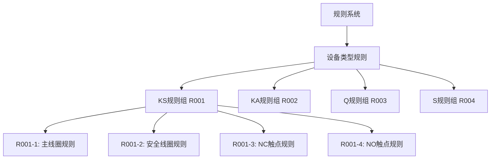
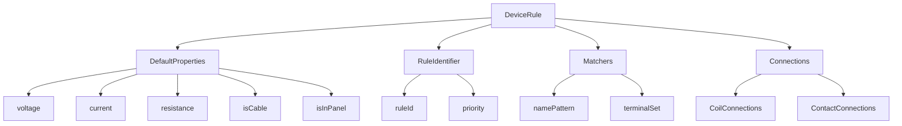

# 设备规则重构计划

## 1. 概述

将设备规则系统从外部JSON配置迁移到代码内部，实现更好的类型安全性和可维护性。

## 2. 规则系统架构

### 2.1 规则编号系统



### 2.2 基本规则类型



## 3. 具体实现设计

### 3.1 基础规则类

```python
class DeviceRule:
    def __init__(self, rule_id, name, description, priority=999):
        self.rule_id = rule_id
        self.name = name
        self.description = description
        self.priority = priority
        self.enabled = True
        
    @property
    def default_properties(self):
        return {
            "voltage": 24.0,
            "current": 0.1,
            "resistance": 240.0,
            "isCable": False,
            "isInPanel": True
        }
```

### 3.2 KS安全继电器规则实现

```python
class KSRule(DeviceRule):
    def __init__(self):
        super().__init__(
            "R001",
            "KS安全继电器规则",
            "安全继电器的识别和连接规则",
            priority=1
        )
    
    def match(self, device_name, terminals):
        """判断设备是否为KS类型"""
        return (device_name.startswith('K') and 
                'A11' in terminals and 'A12' in terminals)
    
    def get_connections(self, points):
        """生成所有连接"""
        connections = []
        # R001-1: 主线圈规则
        connections.extend(self._create_main_coil_connections(points))
        # R001-2: 安全线圈规则
        connections.extend(self._create_safety_coil_connections(points))
        # R001-3: NC触点规则
        connections.extend(self._create_nc_contact_connections(points))
        # R001-4: NO触点规则
        connections.extend(self._create_no_contact_connections(points))
        return connections

    def _create_main_coil_connections(self, points):
        """规则R001-1: 主线圈连接 (A11-A12, A1-A2)"""
        pass

    def _create_safety_coil_connections(self, points):
        """规则R001-2: 安全线圈连接 (S11-S12, S11-S13, S21-S22)"""
        pass

    def _create_nc_contact_connections(self, points):
        """规则R001-3: NC触点连接 (*1-*2规则)"""
        pass

    def _create_no_contact_connections(self, points):
        """规则R001-4: NO触点连接 (*3-*4规则)"""
        pass
```

### 3.3 规则管理器

```python
class RuleManager:
    def __init__(self):
        self.rules = {}
        self._load_rules()
    
    def _load_rules(self):
        """加载所有规则"""
        # KS规则
        self.rules['KS'] = KSRule()
        # 其他规则待添加
        
    def find_matching_rule(self, device_name, terminals):
        """根据设备名称和端子找到匹配的规则"""
        matching_rules = []
        for rule in self.rules.values():
            if rule.enabled and rule.match(device_name, terminals):
                matching_rules.append(rule)
        
        if not matching_rules:
            return None
            
        # 返回优先级最高的规则
        return min(matching_rules, key=lambda x: x.priority)
```

## 4. 实施步骤

1. 创建基础设施
   - 实现DeviceRule基类
   - 实现RuleManager类
   - 设置规则编号系统

2. 实现KS规则（R001）
   - R001-1: 主线圈规则
   - R001-2: 安全线圈规则
   - R001-3: NC触点规则
   - R001-4: NO触点规则

3. 重构主程序
   - 移除JSON配置相关代码
   - 整合新的规则系统
   - 添加规则启用/禁用功能

4. 添加测试
   - 单元测试各个规则
   - 集成测试规则系统
   - 验证规则优先级系统

5. 预留扩展点
   - KA规则接口
   - Q规则接口
   - S规则接口

## 5. 测试计划

### 5.1 单元测试

1. KS规则测试
   - 测试设备类型判断
   - 测试主线圈连接
   - 测试安全线圈连接
   - 测试NC/NO触点连接
   - 测试规则优先级

### 5.2 集成测试

1. 规则系统测试
   - 测试规则加载
   - 测试规则匹配
   - 测试规则执行

2. 连接生成测试
   - 测试完整连接生成流程
   - 验证连接属性正确性
   - 验证无重复连接

## 6. 扩展计划

1. KA规则（R002）
   - 设备名称以K开头但不含A11/A12
   - 连接规则待定义

2. Q规则（R003）
   - 设备名称以Q开头
   - 连接规则待定义

3. S规则（R004）
   - 设备名称以S开头
   - 连接规则待定义