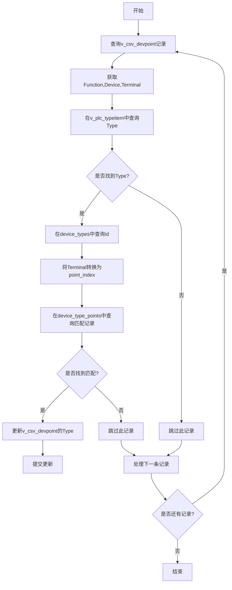

# force_update_device_point 功能实现计划

## 功能目标
根据v_csv_devpoint表中的Function、Device和Terminal值，通过多表关联查询更新Type字段。

## 数据流图



## 实现步骤

1. **函数定义**
   ```python
   def force_update_device_point(conn):
       """根据多表关联更新v_csv_devpoint的Type字段"""
   ```

2. **查询v_csv_devpoint记录**
   ```sql
   SELECT id, Function, Device, Terminal 
   FROM v_csv_devpoint
   WHERE Type IS NULL OR Type = ''
   ```

3. **处理每条记录**
   - 从v_plc_typeitem获取Type:
     ```sql
     SELECT Type FROM v_plc_typeitem
     WHERE Function = %s AND Device = %s
     LIMIT 1
     ```
   - 从device_types获取id:
     ```sql
     SELECT id FROM device_types
     WHERE type_name = %s
     LIMIT 1
     ```
   - 转换Terminal为point_index:
     ```python
     point_index = int(Terminal.replace('T', ''))
     ```
   - 从device_type_points获取point_type:
     ```sql
     SELECT point_type FROM device_type_points
     WHERE device_type_id = %s AND point_index = %s
     LIMIT 1
     ```

4. **更新记录**
   ```sql
   UPDATE v_csv_devpoint
   SET Type = %s
   WHERE id = %s
   ```

5. **提交事务**
   ```python
   conn.commit()
   ```

## 注意事项
1. Terminal值需要转换为point_index（如"T1"→1）
2. 需要处理可能的数据类型转换异常
3. 建议添加事务回滚机制
4. 添加适当的日志记录