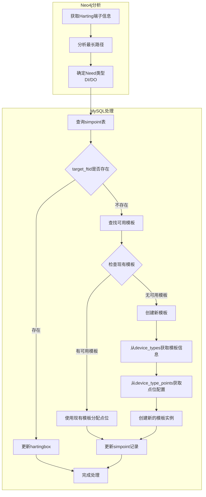

# Harting连接器分析与MySQL更新实现计划

## 1. 总体流程



## 2. 数据库操作

### 2.1 检查现有模板
```sql
-- 检查现有模板数量
SELECT COUNT(*) 
FROM simpoint 
WHERE moduler LIKE 'EDB%' 
GROUP BY moduler;

-- 获取最大模板序号
SELECT MAX(CAST(SUBSTRING(moduler, 4) AS UNSIGNED)) 
FROM simpoint 
WHERE moduler LIKE 'EDB%';
```

### 2.2 模板创建
- 从device_types和device_type_points获取模板配置
- 命名规则：EDB1, EDB2, ... 或 EBD1, EBD2, ...
- 序号从1开始递增

### 2.3 点位分配策略
1. 优先在已有模板中查找空闲点位
2. 如果找不到合适的点位，检查是否达到模板数量限制（10个）
3. 必要时创建新模板

## 3. 具体实现步骤

### 3.1 Neo4j查询优化
- 保持原有的路径分析逻辑
- 确定Need类型（DI/DO）

### 3.2 MySQL更新逻辑
1. **点位查找**：
   - 检查target_ftid是否已存在
   - 如果存在，直接更新hartingbox
   - 如果不存在，进行新分配

2. **新分配逻辑**：
   ```python
   # 伪代码
   def assign_new_point(need_type, harting_group):
       # 1. 检查已有模板
       existing_template = find_available_template(need_type)
       if existing_template:
           return assign_to_template(existing_template)
           
       # 2. 检查是否可以创建新模板
       template_count = count_templates(need_type)
       if template_count >= 10:
           raise Exception("模板数量已达上限")
           
       # 3. 创建新模板
       new_template = create_new_template(need_type)
       return assign_to_template(new_template)
   ```

### 3.3 数据一致性保证
- 使用事务确保更新操作的原子性
- 在分配点位时进行重复检查

### 3.4 错误处理
- 模板数量超限提示
- 分配失败处理
- 数据库连接异常处理

## 4. 配置项

```python
config = {
    'template_limits': {
        'EDB': 10,
        'EBD': 10
    },
    'harting_groups': ['X20', 'X21', 'X22', 'X23']
}
```

## 5. 注意事项

1. 模板命名采用EDB1, EDB2或EBD1, EBD2的形式
2. 每种模板最多创建10个
3. 同一hartingbox组的点位应该使用相同的模板
4. 保持原有的Neo4j查询功能
5. 模板创建时需要同时考虑device_types和device_type_points表的配置