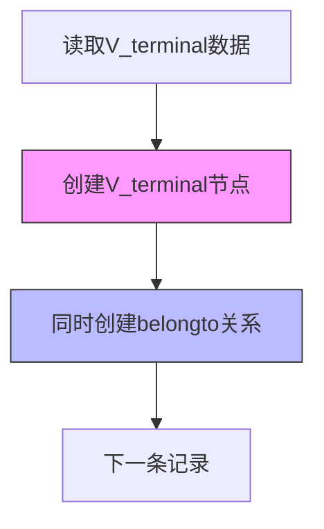
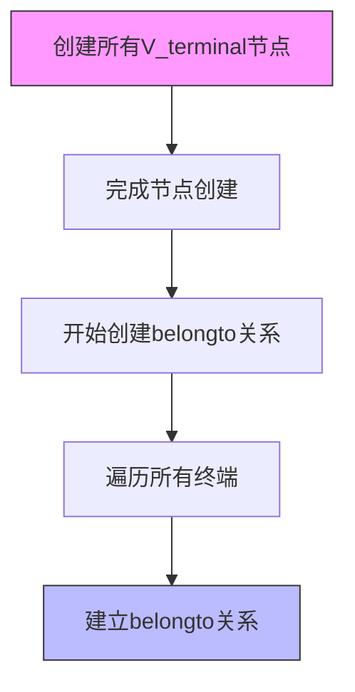

# 终端节点与设备节点关系创建方案

## 两种可能的实现方案

### 方案1：同时创建终端节点和从属关系

优点：
- 性能更好：减少了数据库访问次数
- 原子性：确保每个终端都正确关联到其设备
- 代码逻辑清晰：处理逻辑集中在一起

### 方案2：分步创建

缺点：
- 需要两次遍历数据
- 性能较差：需要额外的数据库操作
- 可能出现数据不一致：如果中间过程出错

## 建议实现方式

建议采用方案1，在create_terminal_nodes函数中同时创建belongto关系。主要修改点：

1. 在创建终端节点的同时创建belongto关系
2. 使用MERGE而不是CREATE确保关系的唯一性
3. 添加适当的错误处理

### 具体实现步骤

1. 修改create_terminal_nodes函数，添加belongto关系创建逻辑
2. 在终端节点创建后立即创建belongto关系
3. 使用MERGE语句确保关系唯一性
4. 添加错误处理和日志记录

### 预期效果

- 每个终端节点创建后都会立即建立与其所属设备的关系
- 避免重复的数据库操作
- 保证数据的一致性
- 提高代码的可维护性