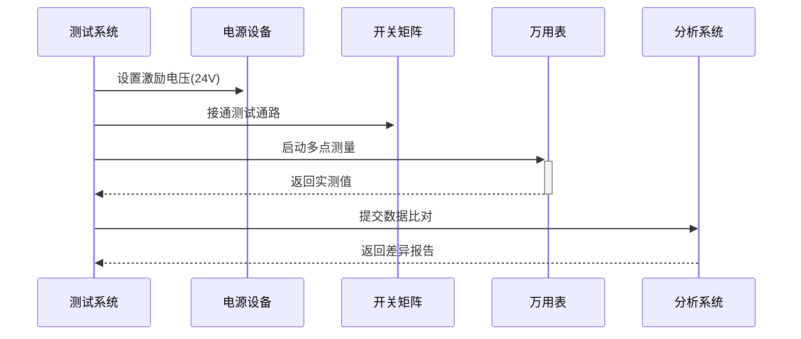

# 电压传播测试系统架构

## 一、系统组件设计

```python
class VoltageTestSystem:
    ├── PathCalculator        # 路径计算引擎
    ├── TestCaseGenerator     # 测试用例管理
    ├── HardwareController    # 物理设备接口
    ├── ResultAnalyzer        # 结果比对系统
    └── ReportGenerator       # 测试报告生成
```

## 二、核心算法设计

### 电压传播路径计算
```cypher
MATCH path=(start:Vertex)-[:conn*]->(end:Vertex)
WHERE start.type IN ['PLC', 'sim'] 
  AND end.type IN ['PLC', 'sim']
  AND start.voltage > 0
RETURN nodes(path) AS propagationPath
```

### 测试用例生成逻辑
```python
def generate_test_cases():
    for plc in PLC_vertices:
        for sim in connected_sim_vertices:
            yield {
                "stimulus_point": plc.id,
                "measure_points": [sim.id],
                "expected_voltage": calculate_expected(plc, sim)
            }
```

## 三、硬件接口规范

| 设备类型   | 控制协议    | 精度要求     | 安全机制         |
|----------|------------|-------------|-----------------|
| 程控电源   | SCPI       | ±0.1V       | 过压保护         |
| 数字万用表 | Modbus RTU | ±0.5%读数    | 自动量程         |
| 开关矩阵  | TCP Socket | 10ms响应     | 互锁机制         |

## 四、测试流程设计



## 五、开发阶段规划

### Phase 1: 基础框架 (2周)
- 实现路径计算引擎
- 建立测试用例模板
- 开发基础硬件驱动

### Phase 2: 系统集成 (3周)
- 实现自动测试流程
- 开发结果分析算法
- 构建异常处理机制

### Phase 3: 优化扩展 (1周)
- 增加并行测试能力
- 实现智能路径预测
- 完善日志系统